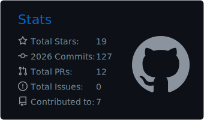
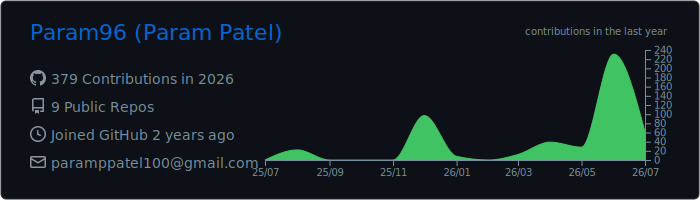
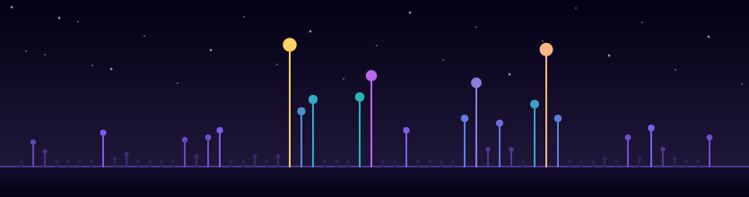

  

  

  
  
  

 

  

## 💫 About Me

<b>Click to expand</b>

 

🔭 **I'm currently working on**
Building full-stack applications while experimenting with AI/ML integrations and real-world use cases.

👯 **I'm looking to collaborate on**
AI-powered products, full-stack projects, and ideas that solve actual problems.

🤝 **I'm looking for help with**
Understanding ML fundamentals deeply and applying them beyond tutorials.

🌱 **I'm currently learning**
Machine learning, data science basics, and how to productionize models.

💬 **Ask me about**
Full-stack development, APIs, databases, project architecture, or getting started with AI/ML.

⚡ **Fun fact**
I prefer building things that work over talking about things that might.

## 🌐 Socials

  

## 🎓 Certifications

<table>
<tr>
<td width="70">
  
</td>
<td>

**IBM Full Stack Software Developer Professional Certificate**
Completed 15 courses covering application development and cloud technologies, with hands-on experience across HTML, CSS, JavaScript, GitHub, Node.js, React, Python, Django ORM, Bootstrap, SQL & NoSQL databases, Docker, Kubernetes, OpenShift, CI/CD, microservices, serverless computing, and application security. Delivered a capstone project and a full SaaS solution built with cloud-native methodologies.

</td>
</tr>
<tr>
<td width="70">
  
</td>
<td>

**Machine Learning Specialization** (DeepLearning.AI & Stanford Online)
Completed all three courses covering supervised learning (linear regression, logistic regression, neural networks, decision trees), unsupervised learning (clustering, anomaly detection), recommender systems, and reinforcement learning — along with best practices for building and applying ML models to real-world problems.

</td>
</tr>
</table>

  

## 💻 Tech Stack

<b>🔤 Languages</b>

 

<b>🤖 AI / ML & Data Science</b>

 

<b>🎨 Frontend</b>

 

<b>🗄️ Backend & Databases</b>

 

<b>☁️ Cloud & Tools</b>

 

<b>🎭 Design & Other</b>

 

  

## 📊 GitHub Stats

### 📈 Activity Graph

### 🔀 Pull Request & Contribution Summary

### 🏆 GitHub Trophies

### ✍️ Random Dev Quote

### 🔝 Top Contributed Repo

  

### 🌱 Contribution Garden

Each stem is a day from the last 60 — taller and brighter the more you shipped that day. Generated entirely by a script in this repo, so nothing outside it can go down.

  

Built with 💙 — Proudly created with <a href="https://gprm.itsvg.in">GPRM</a>

